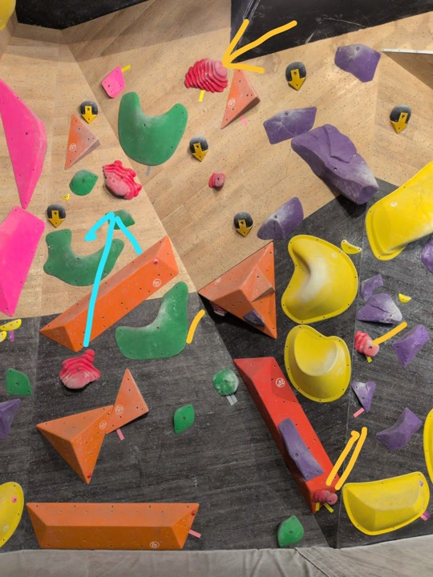

# 第一次抱石

今天中午吃飯時又看了一次 [Magnus Midtbø 跟 PewDiePie 抱石的影片](https://youtu.be/ooFQ4OMFdSI)。其實我偶爾會看 [Magnus Midtbø](https://www.youtube.com/@magmidt)，但一直沒有去真的抱過石。畢竟我也不是一個有在運動的人。但畢竟難得的連假，總是要出門走走啥的嘛。於是我下午就出發了。

## 開始

我去的是[角 • 攀岩館 - 華山店](https://maps.app.goo.gl/ndwehEt48hbXi24v7)，搭到忠孝新生站，往三創那邊走一小段路就到了。進去後掃 QR Code 註冊會員、繳 500 塊（400 入場費 + 100 租鞋）、穿完鞋後，就有一個教練來示範從牆上跳下來時如何著地。

其實在註冊會員時，就已經看了一部影片介紹抱石規則跟著地方法了。但是有真人示範，加上自己真的上去試著跳下來，感受還是很不一樣，我覺得蠻用心的。

牆上的每種顏色的石頭代表一條路線。在路線的一開始會有四張貼紙，表示起始的姿勢，每張貼紙對應身體的一個部位（雙手和雙腳）。如果某顆石頭旁邊有貼紙，就表示你的其中一隻手或腳需要放在那顆石頭上。當雙手同時碰到終點有貼貼紙的石頭時，就算成功。路線的難度是根據起始貼紙的顏色來判斷的，而不是石頭本身的顏色。

新手教學結束後，我就去爬了最簡單的 V0。因為 V0 腳可以任意踩其他顏色的石頭，還算蠻簡單。爬了兩個路線後，我就去爬 V1 了。

## 第一面牆

這間抱石場還滿小的，總共只有兩面牆，V1 難度的路線總共有 5 個。反正我就隨便挑了一個路線爬了。

粉色石頭，黃色膠帶。Hard as fuck。我以為 V1 應該是簡單的阿？在多次嘗試後都沒有成功後，我跑去挑戰另一個 V1。

也是粉色石頭，黃色膠帶。Hard as fuck。至於具體是怎麼個難法，請原諒小弟我的文筆不夠，沒辦法用文字描寫出來。但好在在我某一次嘗試，爬到一半時，有好心人點出我的腳下一步應該往哪裡，最後有成功爬上。

之後，第一個 V1 也是有好心人示範 beta 給我，之後再嘗試幾次後才成功。我感覺技巧在抱石還滿重要的，像我完全不知道任何技術或路線規劃，白白浪費了一堆體力，或嘗試根本不可能的路線。

## 另一面牆

我去的時候是下午四點，大概有八、九個人，初心者跟有經驗的人大概一半一半。雖然大家都是有朋友一起來的，但自己一個人去也不會覺得太尷尬，大家人都蠻好的。之後我去嘗試了另一面牆的三個 V1 路線。

紅色石頭，黃色膠帶。我還蠻驕傲我有成功這一個路線的，因為這個路線需要把手從左中的紅色石頭，跳到左上的紅色石頭上。照片上可能看不出來，但我實際在牆上時，上面那顆石頭遠的跟什麼一樣，反正我已經不相信這個是 V1 了。

而另外兩個 V1 在第一步就失敗了，完全沒有機會。其實原本我還想試試看 V2 難度的路線，但是我看到有一個 V2 要跳到天花板上、雙腳騰空、只用雙手抓住兩個石頭之後，我再嘗試幾次 V1 後便離開了。

## 結束

這一次的抱石總共待了一個半小時，滿好玩的，下次去其他抱石場試試。平常我看 YouTube 上的人在爬 V1，跟走在地上一樣輕鬆，我自己連第一步都爬不上去，果然沒有自己親自體驗過的東西不要輕易的下結論。而且回家的時候我的手已經完全沒力了，我的中指還起了一個水泡，這次抱石還證明了我的身體 weak as fuck，果然平常就應該要多運動。下次有朋友一起去的話感覺更好玩。
