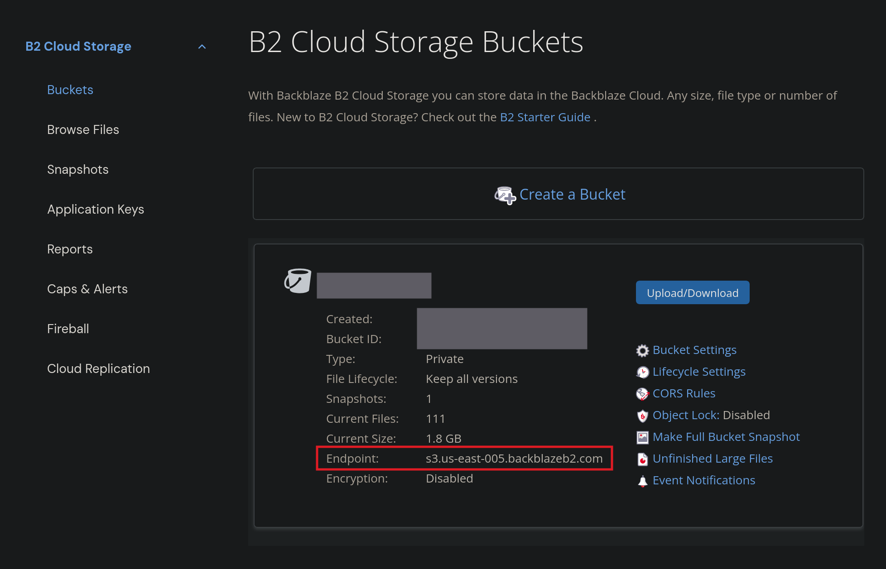

# 用 restic 跟 Backblaze 自動備份

備份是一件一直在我的任務清單裡，但一直沒有做的事。雖然我一直覺得我沒有什麼重要的資料，但還是會有一種不安全感跟心虛感。但是從今以後就不一樣了，以後我就是一個可以在街上昂首闊步、資料都有備份的人了。

要備份的裝置有 homelab 跟筆電，而其中要備份的資料都滿清楚的。我的 homelab 上的 services 全部都是用 docker-compose 部署的，所以只需要備份 `docker-compose.yaml` 跟 volumes。而我的筆電是 [NixOS](https://nixos.org) + [Impermanence](https://github.com/nix-community/impermanence)，只要沒有在 Nix config 裡宣告的資料會在重開機時清掉，而有宣告的資料則會儲存在 `/persist` 裡，所以我只要備份 `/persist` 就沒問題了。

備份的程式我選擇的是 [restic](https://github.com/restic/restic)，因為我的需求並不多，是增量式儲存跟有加密就好了。

雲端空間是用 [Backblaze](https://www.backblaze.com)。主要是[價格](https://www.backblaze.com/cloud-storage/pricing)我覺得很不錯，尤其是考慮到有一些其他的雲端空間，上傳下載都還要另外收費。

雖然依照大家推薦的 best practice，[3-2-1 Backup Strategy](https://www.backblaze.com/blog/the-3-2-1-backup-strategy)，我應該還要有一份備份放在本地。但我最近真的沒有很想要再設置一個 server，而且我覺得 off-site copy 是最重要的，所以這次我就只備份資料到雲端了。

## Backblaze 設置

在 Backblaze 上要新增一個 bucket 做儲存空間跟一個 APP key 讓 restic 可以存取。

新增 bucket 的話，基本上點 create bucket 然後按確認就可以了。我自己是沒有啟用 Backblaze 的加密，因為 restic 自己就有，我就保持它預設的設定。

在 Backblaze 上新增 APP key 也很簡單，點左邊選單的 Application Keys，往下滑一點，點 Add a New Application Key，裡面的選項 Allow access to Bucket 選擇想要的 bucket 就可以了。新增完成後，會跑出這個，要記得保存好：

```
Success! Your new application key has been created. It will only appear here once.
keyID: <secret>
keyName: <name>
applicationKey: <secret>
```

## restic 設置

開始正式用 restic 之前，要先初始化 repository。

restic [支援的後端](https://restic.readthedocs.io/en/latest/030_preparing_a_new_repo.html)很多，雖然它也有直接[支援 Backblaze API](https://restic.readthedocs.io/en/latest/030_preparing_a_new_repo.html#backblaze-b2)，但 restic 自己是推薦使用 [S3-compatible API](https://restic.readthedocs.io/en/latest/030_preparing_a_new_repo.html#s3-compatible-storage) 效果會比較好。所以這次我會用 S3 的方式來設置，使用的環境變數有這些：

```sh
export AWS_ACCESS_KEY_ID="<secret>"
export AWS_SECRET_ACCESS_KEY="<secret>"
export RESTIC_REPOSITORY="s3://<bucket-endpoint>/<bucket-name>"
export RESTIC_PASSWORD="<secret>"
```

其中 `AWS_ACCESS_KEY_ID` 就等於 Backblaze 的 `KeyID`、`AWS_SECRET_ACCESS_KEY` 是 `ApplicationKey`。`bucket-endpoint` 可以在 bucket 頁面找到：



然後跑這個指令：

```sh
restic init
```

## 備份 HomeLab

restic 的備份很簡單，跑 `restic backup [data]...` 就可以了，每次跑完後會創建一個新的 snapshot。

先手動跑第一次備份：

```sh
restic backup containers data
```

因為要上傳資料，所以會跑一段時間。跑完後，確認 snapshots 的狀況：

```sh
restic snapshots
# repository <hash> opened (version 2, compression level auto)
# ID        Time                 Host           Tags        Paths                  Size
# -------------------------------------------------------------------------------------------
# 0263a086  2025-10-05 14:55:09  orangepi5plus              /home/uima/containers  38.646 GiB
#                                                           /home/uima/data
# -------------------------------------------------------------------------------------------
# 1 snapshots
```

這樣就確定沒有問題了。

接下來就使用 [cron](https://en.wikipedia.org/wiki/Cron) 來自動運行備份。Script 長這樣：

```sh
BACKUP_BIN='/home/restic/bin/restic'
LOG_FILE='/var/log/restic-backup.log'

export AWS_ACCESS_KEY_ID='secret'
export AWS_SECRET_ACCESS_KEY='secret'
export RESTIC_REPOSITORY='secret'
export RESTIC_PASSWORD='secret'

"$BACKUP_BIN" backup \
    --verbose \
    --tag=auto \
    /home/uima/containers /home/uima/data \
    >> "$LOG_FILE" 2>&1


"$BACKUP_BIN" forget \
    --verbose \
    --tag auto \
    --host="$(hostname)" \
    --group-by=host,paths \
    --prune \
    --keep-last=10 \
    --keep-daily=3 \
    --keep-weekly=4 \
    --keep-monthly=4 \
    >> "$LOG_FILE" 2>&1

tail -n 1000 "$LOG_FILE" > "${LOG_FILE}.tmp" && mv "${LOG_FILE}.tmp" "$LOG_FILE"
```

基本上就是跑備份（`restic backup`）然後在把舊的 snapshots 刪掉（`restic forget -- prune`）而已。有一點要注意的是，`restic forget` 只會把 snapshots 刪掉，但**不會**把資料從硬碟上移除，所以還要在跑 `restic prune` 或是使用 `--prune` flag，才會真的把沒用的資料刪除。

`restic forget` 中的 `--keep-*` flag 表示要保留那些備份，這樣備份的大小才不會無限增長，又可以保留多個 snapshots。

> [!NOTE]
> 要記得設定有 APP key 的檔案的權限，像 `chmod 700 the-script`，只有擁有檔案的人或 root 可以存取、執行。

然後新增 script 到 cron 上：

```sh
sudo crontab -e
```

```cron
0 */3 * * * flock -n /tmp/restic.lock /home/restic/bin/backup-to-b2
```

每三個小時會跑一次。`flock` 是為了防止上一次備份跑太久又開始執行下一次備份用的。

HomeLab 的備份就好了！

## 備份筆電

最後我的 NisOS config 長這樣：

```nix
services.restic.backups = {
  remote = {
    # repository is in the env file
    paths = [
      "/persist"
    ];
    exclude = [
      "src/*/target"
      "src/*/.direnv"
      "/persist/var"
    ];
    environmentFile = "/persist/secrets/restic-remote-env";
    passwordFile = "/persist/secrets/restic-password";
    timerConfig = {
      OnBootSec = "15min";
      OnUnitActiveSec = "3hour";
      Persistent = true;
    };
    extraBackupArgs = [
      "--tag auto"
    ];
    pruneOpts = [
      "--tag auto"
      "--host=${config.networking.hostName}"
      "--group-by=host,paths"
      "--keep-last 10"
      "--keep-daily 7"
      "--keep-weekly 4"
    ];
    inhibitsSleep = true;
  };
};
```

Rebuild 後就會自己運行 restic 備份了，跟 homelab 上的設置差不多。

> [!NOTE]
> 要記得設定有 APP key 的檔案的權限，像 `chmod 600 /persist/secrets/restic-remote-env /persist/secrets/restic-password`，只有擁有檔案的人或 root 可以存取。

如果要手動觸發，可以用：

```
systemctl restart restic-backups-remote.service
```

BTW，因為 [`createWrapper`](https://mynixos.com/nixpkgs/option/services.restic.backups.%3Cname%3E.createWrapper) 選項是預設啟用，所以還會多一個 `restic-remote` wrapper script。這個 script 會幫你把環境變數設好，所以可以直接跑 `restic-remote snapshots` 等指令而不需要手動管理 API keys 等。我愛 NixOS。

## 讀資料

最後記錄一下怎麽讀資料。我有看到有兩種方式：

### Restore

```sh
restic restore --target <target-dir> <snapshot-hash>
```

第一種是 `restic restore` 指令，運行上面的指令後會把所有在指定的 snapshot 裡的東西下載到 target 目錄裡。

如果只要下載其中一個目錄的話，可以用 `<snapshot-hash>:<dir>` 語法，像：

```sh
restic restore d2e8449d:/data/download --target /tmp
```

這樣就會把 `download` 目錄下載到 `/tmp/download`。

也可以用 `--include` flag 來指定一個檔案：

```sh
restic restore d2e8449d --include /data/download/abc.png --target /tmp
```

這個檔案會被載到 `/tmp/data/download/abc.png`。

ps. 用 `restic ls` 可以列出 snapshot 裡的東西：

```sh
restic ls d2e8449d /data/download
```

### Mount

另一個方式是用 `restic mount`。這個會直接把 repository 掛載到一個目錄下：

```sh
mkdir /tmp/restic

restic mount /tmp/restic
# repository <repo-hash> opened (version 2, compression level auto)
# [0:00] 100.00%  7 / 7 index files loaded
# Now serving the repository at /tmp/restic
# Use another terminal or tool to browse the contents of this folder.
# When finished, quit with Ctrl-c here or umount the mountpoint.
```

之後就可以像普通目錄一樣瀏覽資料，掛載後的結構長這樣：

```sh
cd /tmp/restic

ls --tree --level=3
# .
# ├── hosts
# │   ├── orangepi5plus
# │   │   ├── 2025-10-06T12:00:01+08:00
# │   │   └── latest -> 2025-10-06T12:00:01+08:00
# │   └── uifw
# │       ├── 2025-10-06T10:42:45+08:00
# │       └── latest -> 2025-10-06T10:42:45+08:00
# ├── ids
# │   └── fc0e4e48
# │       └── home
# ├── snapshots
# │   ├── 2025-10-06T10:42:45+08:00
# │   │   └── persist
# │   ├── 2025-10-06T12:00:01+08:00
# │   │   └── home
# │   └── latest -> 2025-10-06T12:00:01+08:00
# └── tags
#     └── auto
#         ├── 2025-10-06T12:00:01+08:00
#         └── latest -> 2025-10-06T12:00:01+08:00
```

## 總結

我的備份方案暫時就長這樣了。

我覺得設置起來沒有很麻煩，但還是要觀察一段時間看看備份的頻率之類的需不需要調整，或是如果要新增一份本地備份的話，一些沒那麼重要的資料也許不用傳到雲端上。

Anyway，備份用好了，感覺人都有底氣了。
