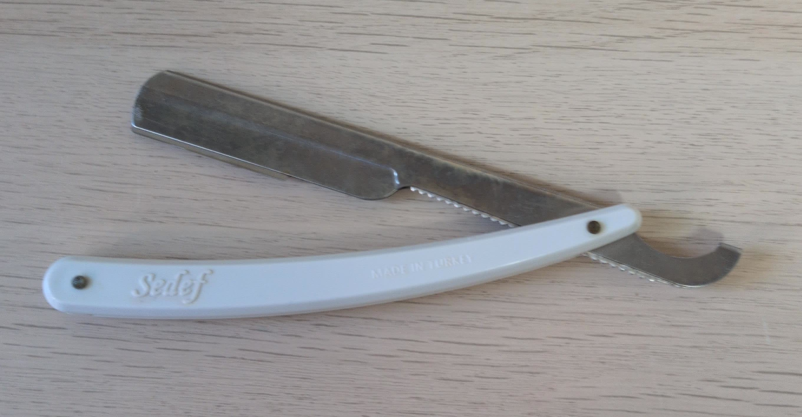
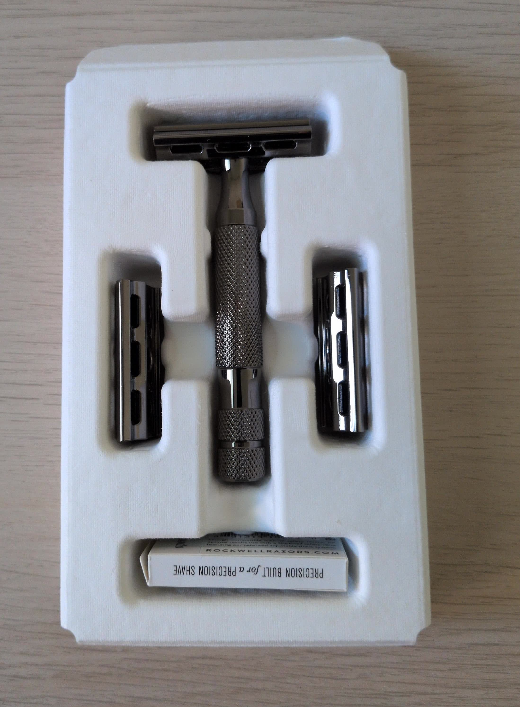
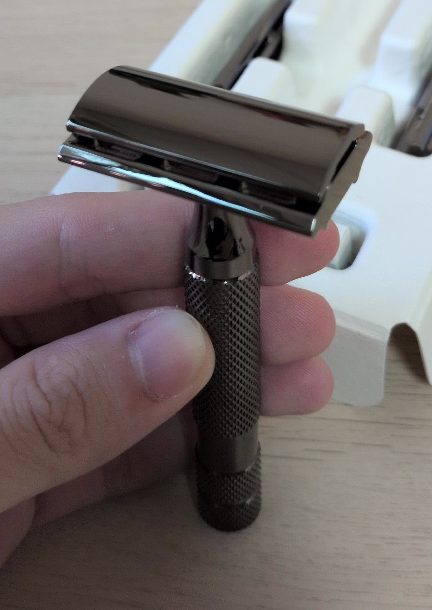
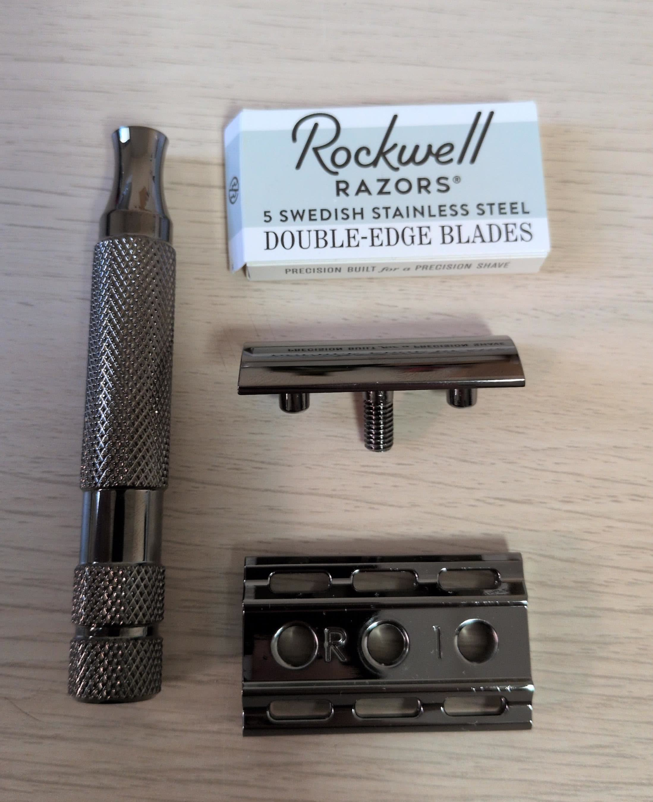
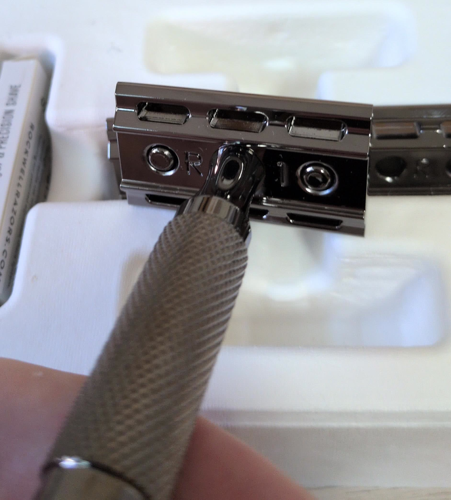
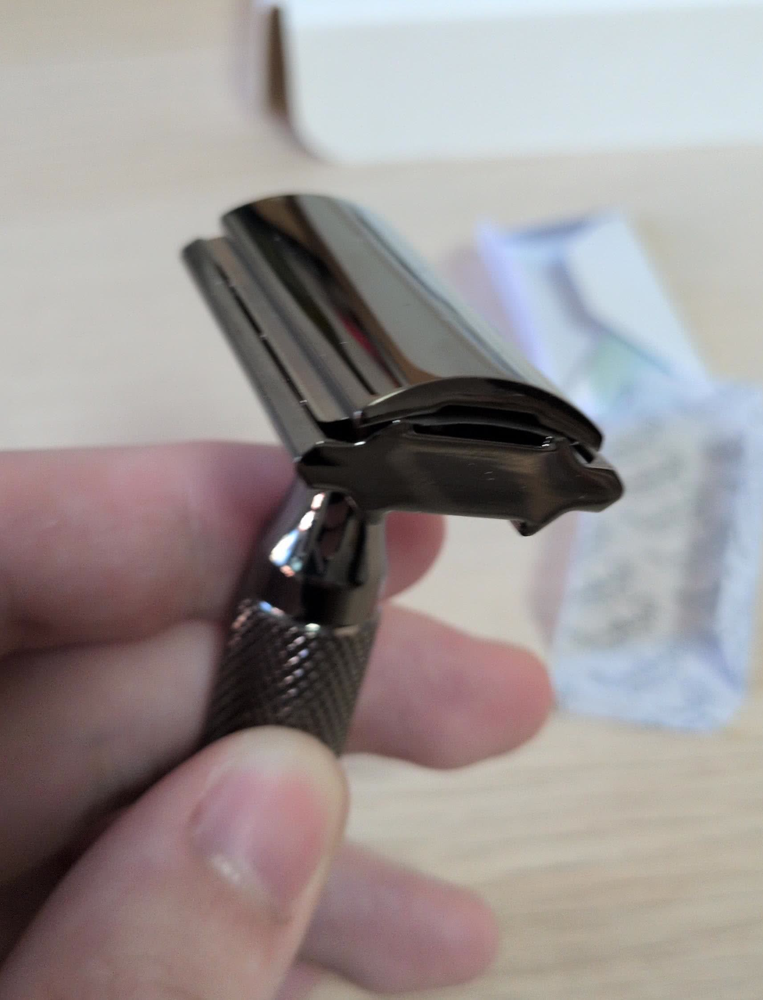

# 從直式剃刀畢業 — 入手第一把安全式剃刀 Rockwell Razors 6C

自從我拋棄普通卡式刮鬍刀（Cartridge Razor），改使用直式剃刀（Shavette）來剃鬚已經過了兩年了（2023-08 ~ 2025-10）。

雖然我還是覺得直式剃刀超帥，但新鮮感過去之後，就慢慢的覺得用直式剃刀有點太麻煩了。主要是在剃鬚的時候需要花費不少專注力，因為就算是使用了兩年，它終究是一把超級鋒利的刀，太不小心的話還是會見血。跟其它小小不便的地方加起來，讓我漸漸想要離開直式剃刀了……

所以！我決定入手第一把安全式剃刀（Safety Razor）。

## 正文

在做了一些功課後，我是在 [MERKUR 34C](https://merkur-razors.com/produkt/merkur-34c) 跟 [Rockwell Razors 6C](https://intl.getrockwell.com/products/rockwell-6c-double-edge-safety-razor) 這兩款很有人氣的剃刀中選擇。最終看上的是後者有 6 種可調整的刀距，而選了 Rockwell Razors 6C。

拿到後的實物長這樣：

我的第一反應就是：喔幹，這不會太帥了嗎？

我以為我會拿到的是像官網第一張圖片一樣，普通金屬的銀色，結果我拿到的是應該是官網第三張圖片的 Gunmetal Chrome （青銅色鍍鉻），暗沉內斂的顏色真的太讚了。而且因為全身是金屬的，拿在手上是有一點份量的，跟我自己的直式剃刀的塑膠廉價感完全不一樣。這就是大人的感覺嗎？

六種可調整的刀距說的就是右下角的刀盤。一共有附三種刀盤，一個刀盤有正反兩面，所以就是六種設定，從一號最溫和、最沒刀片感、到六號最刺激。號碼標在底部：

裝上刀片後長這樣，刀片會被壓成有一點弧度的感覺：

接下來就是實際上臉使用了。

直接說結論，我覺得超讚。

## 結論

把一些我覺得值得分享的地方列出來給大家參考：

- 操作難度低
  安全式剃刀畢竟叫安全式剃刀，只要不做白癡行為（左右滑動之類的），基本上不會見血，上手就會用。使用的時候很省心，跟直式剃刀比的話。
- 角度需要控制
  跟卡式刮鬍刀不一樣，安全式剃刀的刀頭是固定的，不會主動貼到臉上，所以刀跟臉的角度會需要自己控制。有可能是因為我第一次是用比較沒有刀片感的設定（1 跟 3 號），所以有時候不太知道角度有沒有對。但是這種事只要習慣就好了。
- 操作感
  跟直式剃刀比的話，操作感比較低。像是要避開痘痘，或是地形比較崎嶇的地方，就比較難精準刮到。
- 一次使用一整個 DE 刀片
  直式剃刀其中一個煩人的點就是它一次只用半個刀片。所以要用的時候需要先把刀片折成兩半，把連接處掰斷，還要把沒用到的那一半收起來，每個動作都很快，但每次要換刀片的時候都要做的話就變得很煩了。對對對，我知道有賣單邊的刀片，但我喜歡的牌子就沒有r。
- 毛很長的話會卡毛
  洗澡的時候有試著刮刮看腿上的毛，大概 2 公分左右，毛是會卡在刀片上的，就算使用 6 號設定，每刮個一兩下就要清一次。但仔細想想，直式剃刀都要邊沖水邊用毛才不會堆在刀片前了，這應該不是太令人意外的結果吧？
- 很帥
  很帥。

## 後記

以上就是我的第一次安全式剃刀體驗。我對安全式剃刀還是非常滿意的，主要是使用的時候很方便，不用擔心下刀角度、不用換左右手……。真的可以推薦給使用卡式刮鬍刀的人，轉換起來應該是蠻容易可以適應的。
