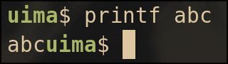
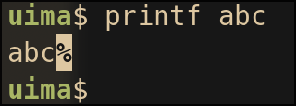
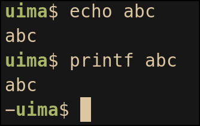

# Fix bash prompt appearing on the same line as the output

In **bash**, when you execute a command that doesn't end its output with a newline, you will see this:



Notice how the prompt appears on the same line as the command output.

This is annoying.

In **zsh**, however, when you do the same thing, you'll have a nice `PROMPT_EOL_MARK` and the prompt will appears on a new line:



This is a zsh feature that preserves partial line by outputting a series of spaces, making the prompt wrap to the next line. Read more on [this zsh doc](https://zsh.sourceforge.io/Doc/Release/Options.html#Prompting).

So I want this feature in bash, and we can do better :)

> The prompt used in the bash example:
>
> ```bash
> PS1='\[\e[1;32m\]\u\[\e[0m\]$ '
> ```

> The prompt used in the zsh example:
>
> ```sh
> PROMPT='%B%F{green}%n%f%b$ '
> ```

## Solution

Here's the solution:

```bash
prompt(){
    # original prompt
    PS1="\[\e[1;32m\]\u\[\e[0m\]$ "

    # get current cursor position
    IFS='[;' read -p $'\e[6n' -d R -rs _ y x _
    # if cursor isn't at the start, put a newline (and a '-' symbol) in the prompt
    if [ $x -ne 1 ]; then
        PS1="\n-$PS1"
    fi
}
PROMPT_COMMAND=prompt
```

This works by checking the cursor position, if the cursor isn't at the column 1, insert a newline in the prompt.

> The get cursor position code snippet comes from [dylanaraps/pure-bash-bible](https://github.com/dylanaraps/pure-bash-bible#get-the-current-cursor-position).

And here's the result:



Looks good, right?

### The marker

This solution has a nice `-` symbol to indicate that the previous command didn’t end with a newline, similar to zsh’s `%` marker.

However, there’s one key difference:

In vanilla zsh, the marker appears right after the output, which can make it easy to accidentally copy the marker when selecting text.
In this version, the marker appears on the next line, so sure I won't accidentally copy it, right?

### Line wrapping

As mentioned earlier, vanilla zsh solves this issue by outputting spaces to push the prompt onto the next line.

But this approach is terminal width sensitive.

So when you resize your terminal, because the number of padding spaces are fixed, the previous output lines will become messy. You can try this at home.

This solution avoids this issue by inserting a newline instead of spaces.
That means it stays nice even after resizing the terminal (at least in my tests).

## Other solutions

### Simplest

```bash
PS1="\n$PS1"
```

This is probably the simplest fix, just add a newline before prompt.

However, when you first open a terminal, you’ll see an empty line at the very top, which doesn’t look great to me.

### Vanilla zsh like approach

```bash
PS1='$(printf "%$((COLUMNS-1))s\r")'$PS1
```

This similar to how zsh handle this issue.
It works by placing `COLUMNS - 1` spaces,
which guarantees that the prompt is pushed to the next line,
and followed by a [carriage return `\r`](https://en.wikipedia.org/wiki/Carriage_return) which moves the cursor back to the beginning,
then draw the prompt.

This is the solution I found online.

It works, but it comes with the same resizing issue as zsh, and worse, because bash doesn’t handle it as gracefully.

## Final

I didn't expect that I will spend this much time on this small issue...

[My current bash config](https://github.com/uimataso/nix-config/blob/main/modules/home-manager/sh/bash/default.nix#L104)
