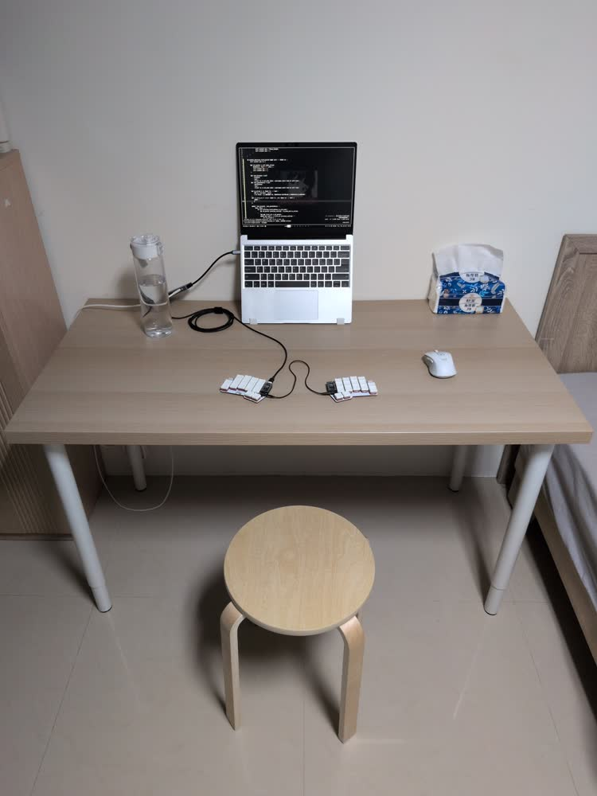
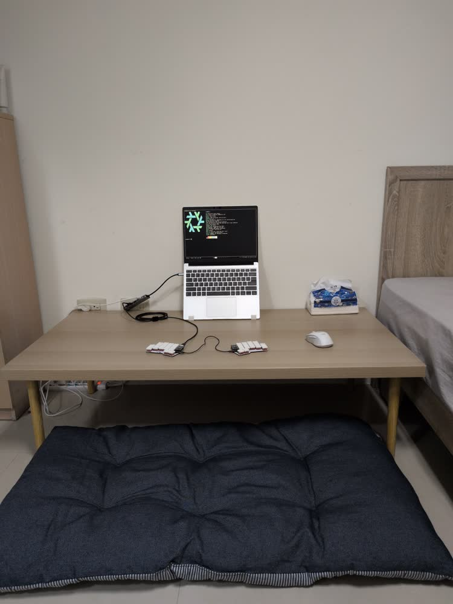

# 成為 Floor Gang

我平常都是盤腿坐在我家的木頭椅子上。

最近發現一件事，我其實很少好好坐在椅子上。

家裡的這張椅子，坐久了一定盤腿。在公司也是，明明是辦公室椅，腳還是會跑到椅子上，如果看 code 看太久，甚至會跪坐在椅子上看。

我反而坐在地上比較自然。

最近在家用電腦的時候，我常常直接坐在地上，把椅子當桌子用。

但問題是，椅子的高度對坐在地上的人來說偏高。肩膀會不自覺抬起來，用久了會累。

讓我想到，日本的和室，本來就有低桌、坐墊、直接在地板活動的生活方式。生活不一定要椅子。

所以我缺的，只是一張和室桌 ;)。

但我也不想為了這件事買一張新桌子。

所以我去蝦皮買了 30 公分高的桌腿，把現在那張 Ikea 桌子的桌腿換掉；又去宜得利買了坐墊。

結果長這樣：

我只能說非常的讚。非常舒適。

推薦給坐椅子都盤腿坐的你。
