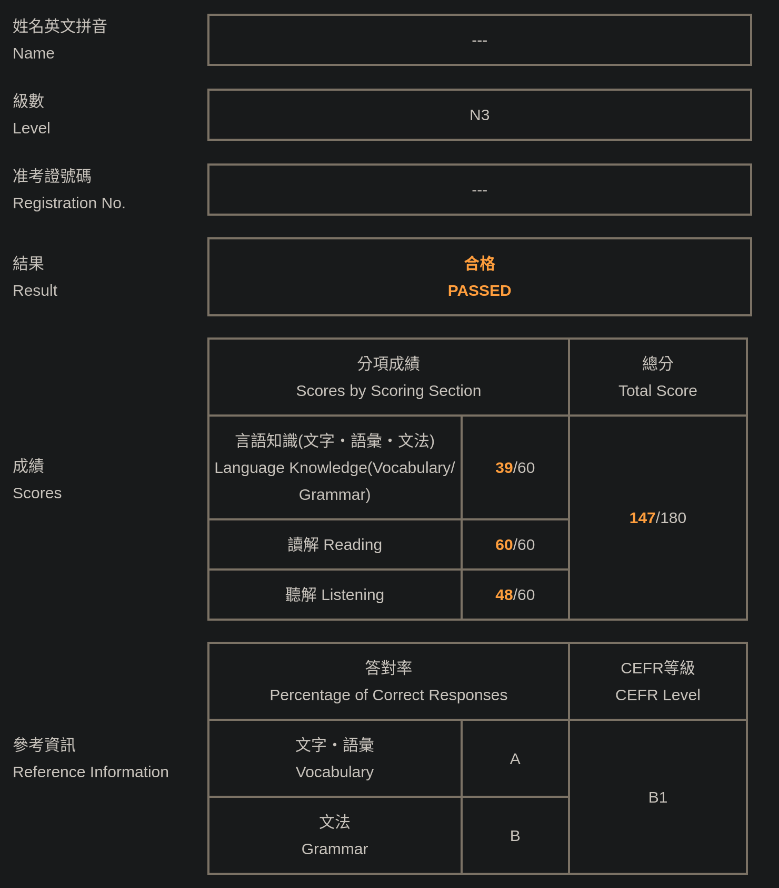

# 通過日檢 JLPT N3

Yeah！恭喜我通過日檢 N3！

## 準備方式

有使用的資源：

- [Tae Kim's Guide to Learning Japanese](https://guidetojapanese.org/learn/grammar)

  在 Reddit 上被推薦的文法書，但老實說我只有讀了前面幾個章節

- [Japanese course based on Tae Kim's grammar guide & anime](https://ankiweb.net/shared/info/911122782)

  根據 Tae Kim's Guide 做的文法 [Anki](https://apps.ankiweb.net) 卡組

- [【egg rolls】JLPT N1～N5 一万词 v3【简／繁】【语音＆例句】](https://github.com/5mdld/anki-jlpt-decks)

  單字 Anki 卡組

可以看到，主要就是靠 Anki。

時間上，因為準備時間只有半年，在準備的前半段，文法跟單字的 Anki 卡組一起跑，大概每天花通勤時間加上一小時左右。
到後半段，文法的 Anki 卡組跑完後，每天的通勤時間加上零碎的時間就差不多了。

我覺得文法跟單字卡組都對蠻有幫助的。

但是我覺得文法不是特別適合用 Anki 學習，因為沒有一個很準確的方式讓自己衡量每張卡的學習程度。
在前半段，文法還很簡單的時候，每張卡都是 Good。
到了後半段，每張卡都是感覺有對、又感覺差了一點，很難決定是 Hard 還是 Good。
但有跑過一次還是蠻不錯的，至少強迫自己讀一些文法規則。

單字方面，因為沒考過前面的日檢，所以這次是從 N5 背到 N3。
每天大概三四十張新卡加上 80 到 100 張舊卡。
老實講有一點太多，如果有人也是一次要準備 N5 到 N3 的單字的話，還是把時間拉長一點吧！

BTW，這次是我第一次用 Anki，我覺得 Anki 跟 egg rolls 的卡組都很不錯，接下來的考試也會繼續用。

## 下一步

像[上一篇](./2025-12-07-today-is-jlpt-n3-exam.md)說的一樣，主要的目標是通過今年底的 N2 考試。

像是現在我應該要準備 N2 的單字了，但我還沒開始背 ;)

另一個任務是看有沒有機會加入 Discord、VRChat 之類的，跟其他人用日文聊天。

怎麽說呢，我現在看日文影片是沒有問題，但是用日文跟人正常交流是不可能。
而且我覺得就算我考到 N1，只要我沒有真的練習跟人對話，我就不可能可以用日文跟人聊天。

所以，可以跟人用日文對話是今年的目標之一。
