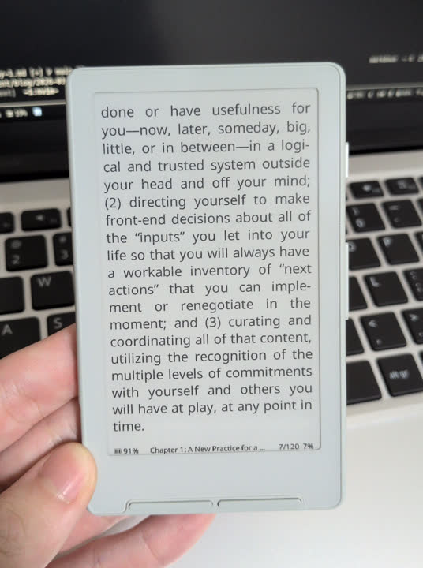
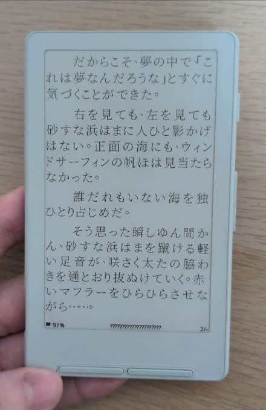
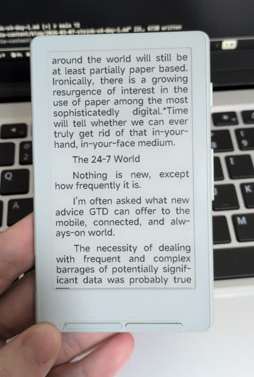
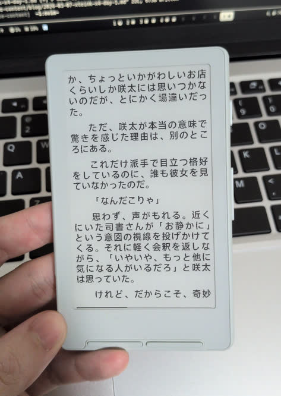

# Xteink X4 / 閱星曈X4 Day 1

我買的[閱星曈X4](https://www.xteink.com/products/xteink-x4) 在昨天到了。

閱星曈X4 是一台超小的電子紙閱讀器。沒有觸控、沒有顏色，就是一台只能用來閱讀的機器。

眾所周知，我對這種超小、單一功能的東西沒有什麼抵抗力。

## OpenSource Firmware

拿到機器、稍微玩一下之後。理所當然的是要刷成 OpenSource 的 firmware 啊！

可以用開源 firmware 也是我想要入手這台機器的重要原因。

眾所周知，我對開源的東西沒有什麼抵抗力。

### Crosspoint

[Crosspoint](https://github.com/crosspoint-reader/crosspoint-reader) 是社區上大家最推的開源 firmware。

剛裝完 Crosspoint 後的體驗很好。UI 很好看，沒有多餘的東西；按鍵的回饋有很大的提升；大概是因為 anti-aliasing，閱讀模式的文字也變得很好看。

一切都很美好...

但愚蠢如我...

裝完後才發現：

**Crosspoint 不支援[中文](https://github.com/crosspoint-reader/crosspoint-reader/tree/1.1.1/USER_GUIDE.md#supported-languages)、[日文](https://github.com/crosspoint-reader/crosspoint-reader/issues/604)啊啊！**

不支援 CJK 字體的主要原因看起來是：硬體的 flash 太小，CJK 字體太大，所以沒辦法直接把字體塞進 firmware。

emmm...

我最近在[學日文](/blog/2026-02-07-jlpt-n3-passed.md)，所以我是很期待可以用它讀一些日文小說的...

好吧，試試下一個吧。

### Crosspoint CJK

在 Crosspoint 的 [issue](https://github.com/crosspoint-reader/crosspoint-reader/issues/604) 裡，有人提到有人有做了 [CJK fork](https://github.com/aBER0724/crosspoint-reader-cjk)，支援從 SDCard 裡讀 CJK 字體。

但裝完之後，我遇到兩個問題：

- 在 README 裡有提到，如果要安裝字體的話，需要用 `tools/generate_cjk_ui_font.py` 把字體轉換成支援的格式。

  但我執行後只得到 `.h` 檔，而不是 `.bin` 檔，我也不知道怎麼繼續下一步。

- 另外一點是，不知為何，我覺得它 render 出來的字，跟上游的比差了一點點。

現在還不是很想花太多時間研究字體，先試下一個吧...

### Papyrix

[Papyrix](https://github.com/bigbag/papyrix-reader) 是 Crosspoint 的 fork。

雖然安裝跟字體轉換有一點麻煩，但總之還是弄好了。

看來字體還需要在調一下呢，看起來破破的...

誒，除了閱讀模式裡的字有正確顯示出來外，其他地方的字都是 ???。

emmm...

[看來](https://github.com/bigbag/papyrix-reader/issues/83)是因為 UI 部分還是用內建的字體，還沒有支援 CJK。

好吧，試下一個...

### SUMI

[SUMI](https://github.com/psychoplath9450/SUMI) 是 Papyrix 的 fork。主要的特色是 plugin 系統，可以在上面做遊戲之類的，的樣子。

但，畢竟中心不是在 CJK 上，我也不需要這些功能，就先跳過了。看起來是滿有趣的，記在這邊，有機會的話可以裝來玩玩。

## Stock OS

誒，我怎麼又回來了。

轉了一圈，還是要用原廠 firmware 嗎？

既然都到這邊了，也說說我對原廠 firmware 在意的點：

- proprietary software

  不是開源，用起來就是不太舒服。但，我不會讓這個裝置連網，某種程度上還算可以接受。

- 按鍵回饋很爛

  按鍵在按下之後，在動作完成之前的輸入都不會被接受。所以可能連按了好幾下，只有第一下有被輸入進去。

- 沒有 anti-aliasing

  跟 Crosspoint 比，render 出來的字比較不好看。

不過，我原本是聽說原廠只支援 txt 檔，但看來最近有更新，epub 也可以正常開啟了。
而且，日文的字體看起來也還可以。

看來我暫時都會用原廠 firmware 了。

## Ending

雖然還有一些地方可以試，但畢竟我都還沒正式開始使用，實在不是很想花太多時間在 tinker 上（已經花很多時間了...）。先用一段時間再說吧。如果沒意外的話，我會想等到 Crosspoint 支援 CJK。

題外話，如果這台機器可以用 Anki 的話就太神了。

如果之後使用上有什麼心得再跟大家分享。拜拜。
